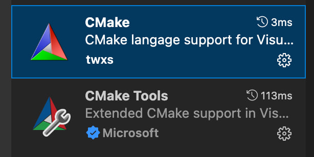

# CMake-CPP-Project-Template
A simple project template to get you started with C++

## How to use in VScode
- Install GCC, Cmake in Your system
- Download Cmake tools:   

- Active Cmake tools in vscode:   

- use 1 to build and 2 to run:   

