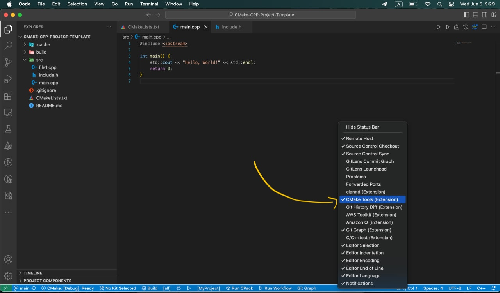
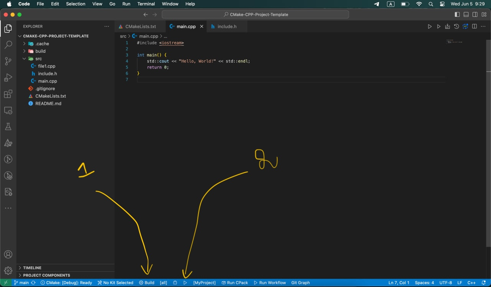

# CMake-CPP-Project-Template
A simple project template to get you started with C++

## How to use 
1. Install VS Code
Download and install Visual Studio Code from here: https://code.visualstudio.com/
2. Install GCC
- On Windows:
Install MinGW:
Download the MinGW installation manager from MinGW-w64: https://www.mingw-w64.org/
Run the installer and select the packages for the C++ compiler (g++) and related tools.
Add the bin directory of your MinGW installation to your system's PATH environment variable. This allows you to use g++ from the command line.

- On macOS:
Install Homebrew if you haven't already:
```
/bin/bash -c "$(curl -fsSL https://raw.githubusercontent.com/Homebrew/install/HEAD/install.sh)"
```
Install GCC using Homebrew:
```
brew install gcc
```

- On Linux:
Use your distribution's package manager. For example, on Ubuntu:
```
sudo apt update
sudo apt install build-essential
```

3. Install C++ and Cmake Extensions for VS Code  
- C/C++ Extension Pack from Microsoft:  
https://marketplace.visualstudio.com/items?itemName=ms-vscode.cpptools-extension-pack

Which includes a set of popular extensions for C++ development in Visual Studio Code:  
C/C++  
C/C++ Themes  
CMake  
CMake Tools  

4. How to build and Run 

- Active Cmake tools in vscode:   

- use 1 to build and 2 to run:   

